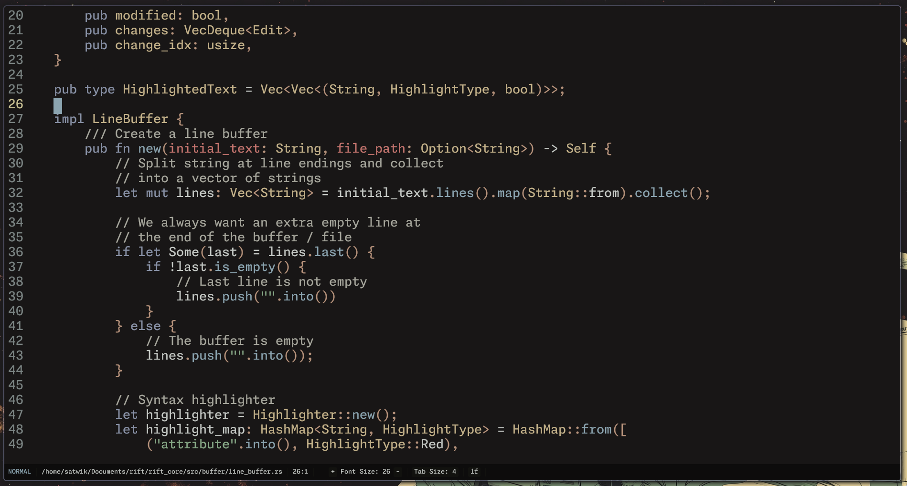

# Rift Editor

Extensible modal code editor inspired by emacs, neovim and helix.



## Try it out!

Prebuilt executables: [Latest release](https://github.com/satwik-kambham/rift/releases/latest)

### Run with Nix (Preferred)

- TUI frontend:
  ```
    nix run github:satwik-kambham/rift#rift_tui
  ```

### Run with Docker

- Build the image:
  ```
    docker build -t rift .
  ```
- Run the web server frontend:
  ```
    docker run -p 3000:3000 rift
  ```
- Run the TUI frontend:
  ```
    docker run -it rift rt
  ```
- Run without audio:
  ```
    docker run -p 3000:3000 rift rift_server --no-audio
  ```

## Features

- Modal Editing
- Tree sitter syntax highlighting
- LSP Integration
- Extendable via the RSL scripting language
- Agentic coding assistant
- Voice control (optional; see Synapse API below)

## Optional voice control

Speech-to-text and text-to-speech rely on a web API running on port 8000.
See the Synapse repo for setup and run instructions: https://github.com/satwik-kambham/synapse

## Documentation

- RSL quick start: [docs/rsl-quickstart.md](docs/rsl-quickstart.md)
- Additional docs in the `docs/` directory.
